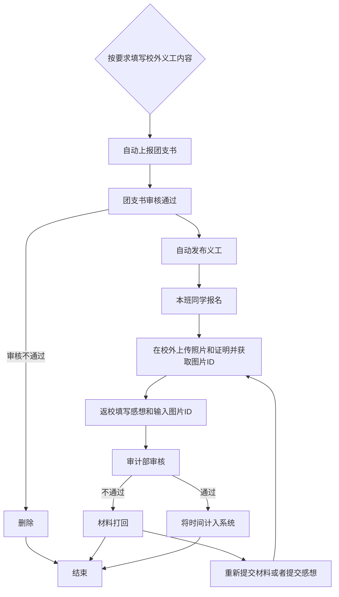

# 帮助文档

## 义工流程

```mermaid
graph TD;
开始{"按要求填写校外义工内容"}-->自动上报团支书-->团支书审核通过;
团支书审核通过-->|审核不通过|删除;
团支书审核通过-->自动发布义工;
自动发布义工-->本班同学报名;
本班同学报名-->在校外上传照片和证明并获取图片ID;
在校外上传照片和证明并获取图片ID-->返校填写感想和输入图片ID;
返校填写感想和输入图片ID-->审计部审核;
审计部审核-->|不通过|材料打回;
材料打回-->重新提交材料或者提交感想-->在校外上传照片和证明并获取图片ID;
审计部审核-->|通过|将时间计入系统;
删除-->结束;
材料打回-->结束;
将时间计入系统-->结束;
```