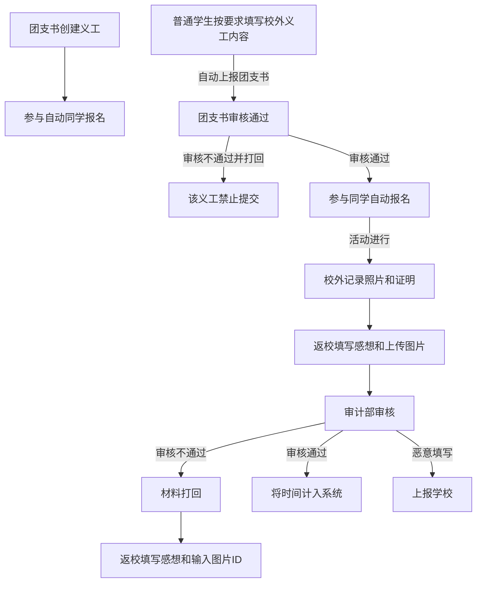
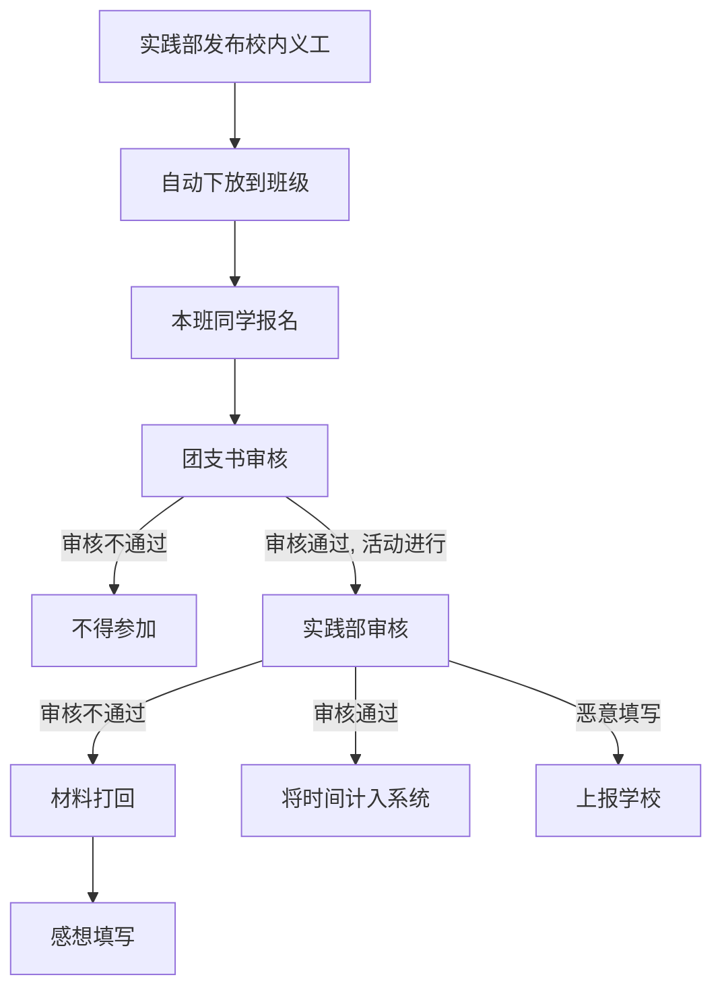
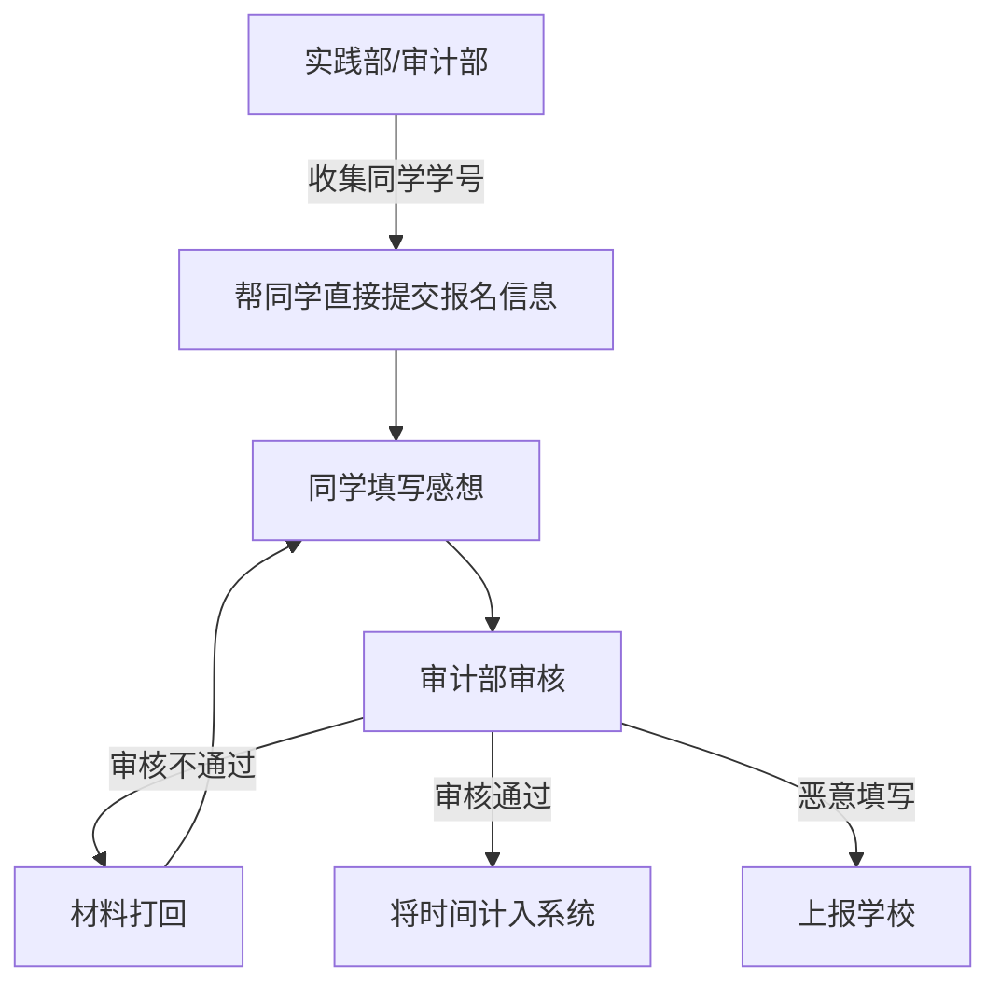
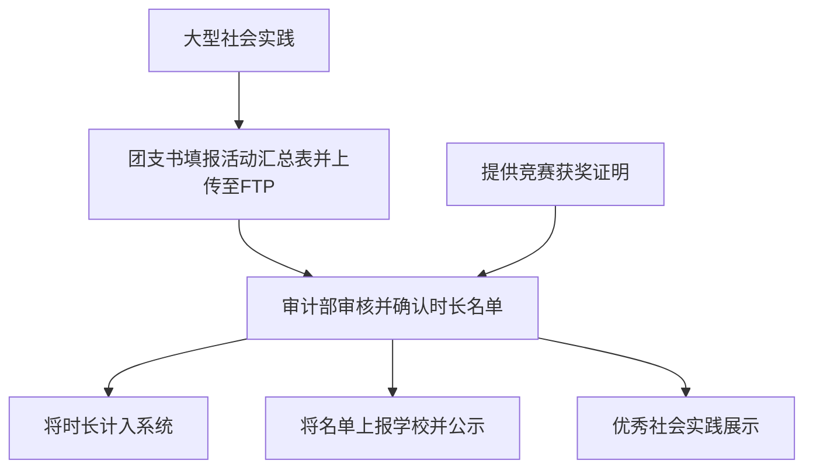

## 1.假期义工自提交流程

```mermaid
graph TD;
团支书创建义工-->参与自动同学报名;
普通学生按要求填写校外义工内容-->|自动上报团支书|团支书审核通过;
团支书审核通过-->|审核不通过并打回|该义工禁止提交;
团支书审核通过-->|审核通过|参与同学自动报名;
参与同学自动报名-->|活动进行|校外记录照片和证明;
校外记录照片和证明-->返校填写感想和上传图片;
返校填写感想和上传图片-->审计部审核;
审计部审核-->|审核不通过|材料打回;
材料打回-->返校填写感想和输入图片ID;
审计部审核-->|审核通过|将时间计入系统;
审计部审核-->|恶意填写|上报学校;
```

## 2.常规校内义工流程

```mermaid
graph TD;
实践部发布校内义工-->自动下放到班级;
自动下放到班级-->本班同学报名;
本班同学报名-->团支书审核;
团支书审核-->|审核不通过|不得参加;
团支书审核-->|审核通过, 活动进行|实践部审核;
实践部审核-->|审核不通过|材料打回;
实践部审核-->|审核通过|将时间计入系统;
实践部审核-->|恶意填写|上报学校;
材料打回-->感想填写;
```

## 3.临时义工事后填报流程

```mermaid
graph TD;
实践部/审计部-->|收集同学学号|帮同学直接提交报名信息;
帮同学直接提交报名信息-->同学填写感想;
同学填写感想-->审计部审核;
审计部审核-->|审核不通过|材料打回;
审计部审核-->|审核通过|将时间计入系统;
审计部审核-->|恶意填写|上报学校;
材料打回-->同学填写感想;
```

## 4.大型社会实践/竞赛获奖义工填报流程

```mermaid
graph TD;
大型社会实践-->团支书填报活动汇总表并上传至FTP-->审计部审核并确认时长名单;
提供竞赛获奖证明-->审计部审核并确认时长名单;
审计部审核并确认时长名单-->将时长计入系统;
审计部审核并确认时长名单-->将名单上报学校并公示;
审计部审核并确认时长名单-->优秀社会实践展示;
```
