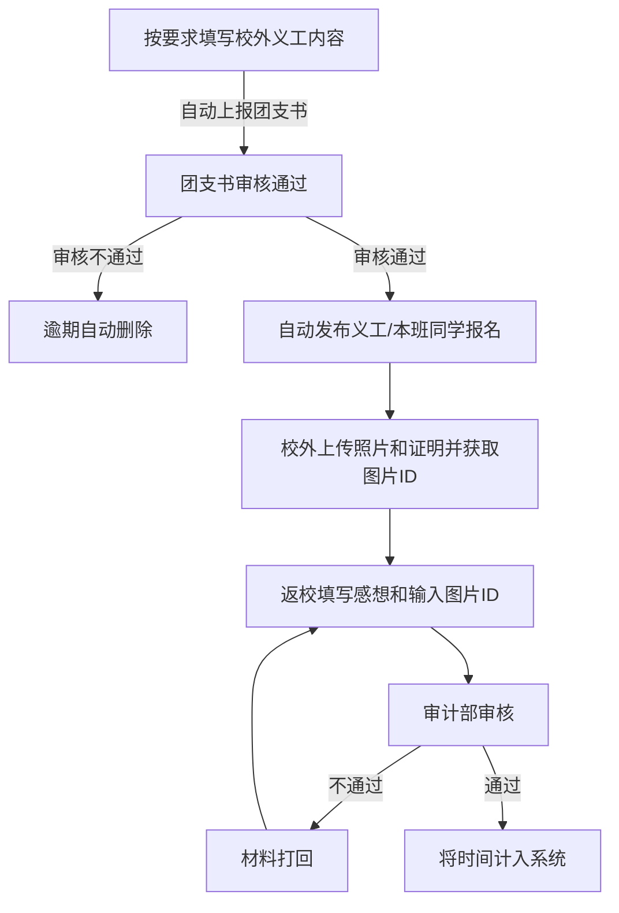
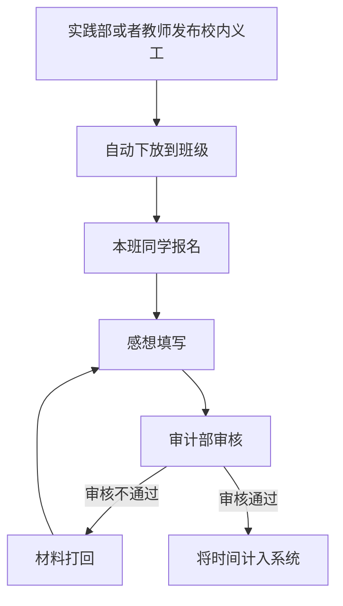
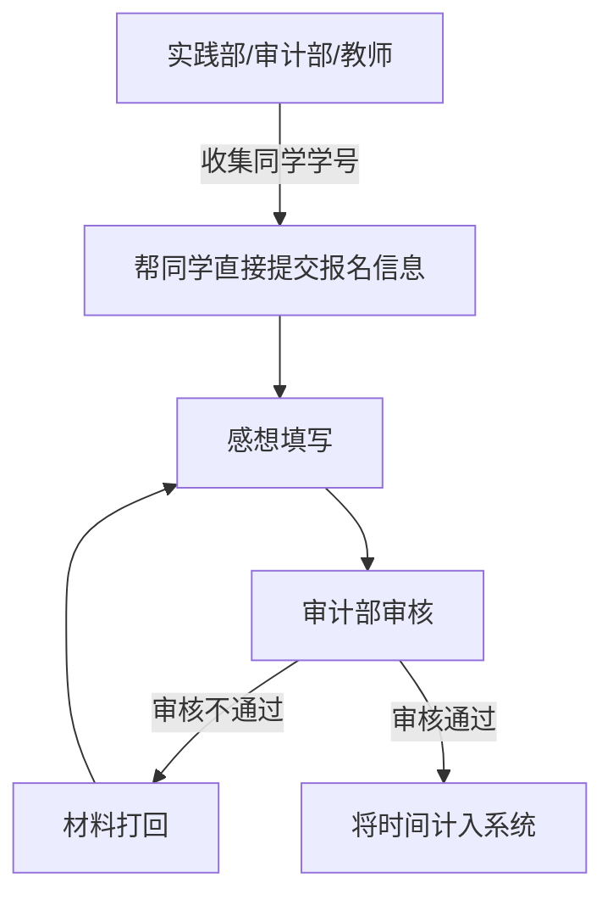
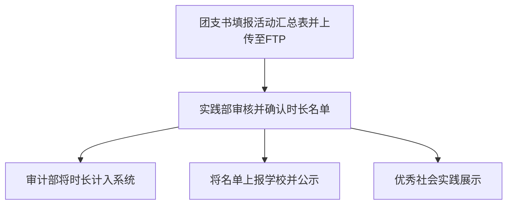

## 1.假期义工自提交流程

```mermaid
graph TD;
按要求填写校外义工内容-->|自动上报团支书|团支书审核通过;
团支书审核通过-->|审核不通过|逾期自动删除;
团支书审核通过-->|审核通过|自动发布义工/本班同学报名;
自动发布义工/本班同学报名-->校外上传照片和证明并获取图片ID;
校外上传照片和证明并获取图片ID-->返校填写感想和输入图片ID;
返校填写感想和输入图片ID-->审计部审核;
审计部审核-->|不通过|材料打回;
材料打回-->返校填写感想和输入图片ID;
审计部审核-->|通过|将时间计入系统;
```

## 2.常规校内义工流程

```mermaid
graph TD;
实践部或者教师发布校内义工-->自动下放到班级;
自动下放到班级-->本班同学报名;
本班同学报名-->感想填写;
感想填写-->审计部审核;
审计部审核-->|审核不通过|材料打回;
审计部审核-->|审核通过|将时间计入系统;
材料打回-->感想填写;
```

## 3.临时义工时候填报流程

```mermaid
graph TD;
实践部/审计部/教师-->|收集同学学号|帮同学直接提交报名信息;
帮同学直接提交报名信息-->感想填写;
感想填写-->审计部审核;
审计部审核-->|审核不通过|材料打回;
审计部审核-->|审核通过|将时间计入系统;
材料打回-->感想填写;
```

## 4.大型社会实践义工统一填报流程

```mermaid
graph TD;
团支书填报活动汇总表并上传至FTP-->实践部审核并确认时长名单;
实践部审核并确认时长名单-->审计部将时长计入系统;
实践部审核并确认时长名单-->将名单上报学校并公示;
实践部审核并确认时长名单-->优秀社会实践展示;
```
